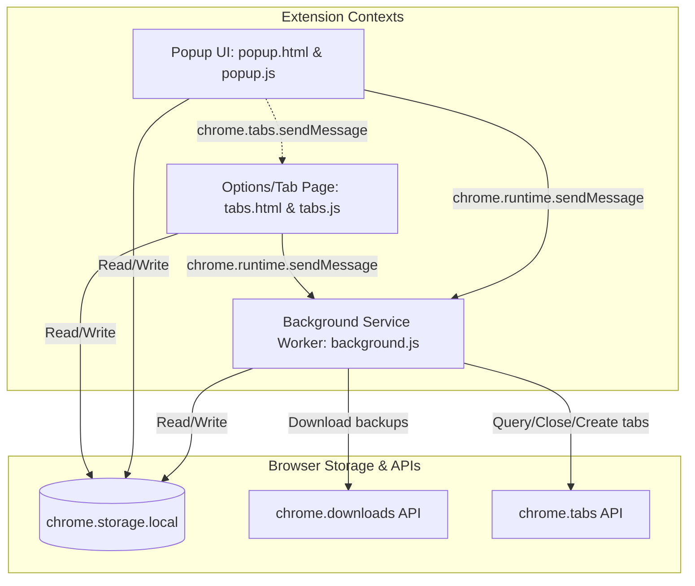

# TwoTab Architecture Documentation

This document describes the high-level architecture and component interactions of **TwoTab**, a Chrome browser extension built on Manifest V3.

## System Components

TwoTab is structured as a standard Manifest V3 Chrome extension. It consists of three primary contexts running in separate sandboxes:



### 1. Background Service Worker
- **File**: [background.js](file:///Users/ali/Documents/Programming/MyGitHub/TwoTab/background.js)
- **Role**: Coordinates the core logic of capturing and closing open tabs, saving them to storage, and initiating automatic file backups.
- **Lifetime**: Event-driven (starts when a message is received, goes idle when inactive).

### 2. Browser Popup Action
- **Files**: [popup.html](file:///Users/ali/Documents/Programming/MyGitHub/TwoTab/popup.html) & [popup.js](file:///Users/ali/Documents/Programming/MyGitHub/TwoTab/popup.js)
- **Role**: Provides a quick, small interface (width: `420px`) for saving the current window's tabs, searching the most recent saved tab groups, and restoring or deleting them.
- **Lifetime**: Instantiated when the user clicks the extension icon in the toolbar, destroyed immediately when the popup loses focus.

### 3. Full-Page Tab Manager (Options Page)
- **Files**: [tabs.html](file:///Users/ali/Documents/Programming/MyGitHub/TwoTab/tabs.html) & [tabs.js](file:///Users/ali/Documents/Programming/MyGitHub/TwoTab/tabs.js)
- **Role**: Serves as a full-page interface to view, search, name/rename, import, export, delete, and restore all saved tab groups.
- **Lifetime**: Lives as a normal browser tab. Registered as the `"options_page"` in [manifest.json](file:///Users/ali/Documents/Programming/MyGitHub/TwoTab/manifest.json).

---

## Extension API Integrations

The extension interacts with the Google Chrome Extension APIs for tab management, storage, and file downloads:

1. **`chrome.tabs`**: Used to query currently open tabs, create new blank tabs or restore saved tabs, and close tabs that have been saved.
2. **`chrome.storage.local`**: Stores the persistent state of all saved tab groups.
3. **`chrome.downloads`**: Triggers backup file downloads directly to the user's local downloads directory.
4. **`chrome.runtime`**: Facilitates background messaging between popup, tab, and background scripts.

---

## Inter-Component Messaging

### 1. Save Tabs Flow
When a user clicks "Save Tabs" in the popup or options page:
1. The UI script ([popup.js](file:///Users/ali/Documents/Programming/MyGitHub/TwoTab/popup.js) or [tabs.js](file:///Users/ali/Documents/Programming/MyGitHub/TwoTab/tabs.js)) sends a message to the background page:
   ```json
   { "action": "saveTabs" }
   ```
2. The background script ([background.js](file:///Users/ali/Documents/Programming/MyGitHub/TwoTab/background.js)) intercepts the message via `chrome.runtime.onMessage.addListener`.
3. It performs the query, storage update, tab closure, and backup file creation.
4. It responds back with `{ status: "success" }` or `{ status: "error" }`.

### 2. Import Trigger Flow
- **Path**: [popup.js](file:///Users/ali/Documents/Programming/MyGitHub/TwoTab/popup.js) attempts to trigger import on options page by opening `tabs.html` and sending a message:
  ```json
  { "action": "triggerImport" }
  ```
- **Implementation**: This is fully handled in [tabs.js](file:///Users/ali/Documents/Programming/MyGitHub/TwoTab/tabs.js) via a runtime message listener. Clicking "Import" in the popup correctly redirects to the dashboard and automatically triggers the system file picker dialog for a seamless experience.
